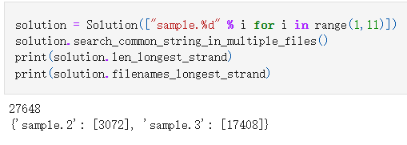

# Eluvio_Intern
Hello recruiting team! This file would show you how to run my program.

## First Step
Import the file we wanna use and store the file name as a list.
e.g. filename_list = ['sample.1','sample.2','sample.3']

## Second Step
Use the class I created called 'Solution' to import the file 
e.g. solution = Solution(filename_list)

## Third Step
Use the function called search_common_string_in_multiple_files() to process the file
the filenames that contained longest strand will store in filenames_longest_strand
the length of longest strand will store in len_longest_strand
e.g.solution.search_common_string_in_multiple_files()

print(solution.len_longest_strand)

print(solution.filenames_longest_strand)

## Output
Here is the output for the 10 test sample

we can see the longest strand has length 27648 and store in sample.2 at index 3072 and sample.3 at index 17408
